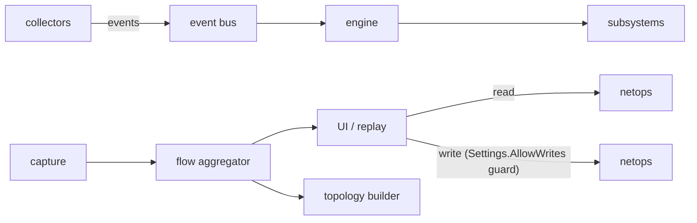

# Testudo - Developer Guide

This document is the engineering counterpart to `README.md`. It targets contributors
who need to build, run, test, and extend Testudo locally.

---

## 1. Prerequisites

| Requirement | Notes |
|---|---|
| Go | 1.22 or newer |
| Linux kernel | 5.4+ recommended (AF_PACKET, netlink, nftables) |
| Capabilities | `CAP_NET_RAW`, `CAP_NET_ADMIN` for the binary at runtime |
| Optional | `iptables` binary for the legacy firewall backend |
| Optional | `sqlite3` CLI for ad-hoc inspection of session storage |

Testudo is developed against Ubuntu and Debian-based systems. Fedora / Arch /
openSUSE are roadmap targets - patches welcome.

---

## 2. Build & Run

```bash
# Build the binary into the repo root.
go build -o testudo ./cmd/testudo

# Run with packet capture enabled (needs CAP_NET_RAW).
sudo setcap cap_net_raw,cap_net_admin=eip ./testudo
./testudo live
```

Common invocations:

```bash
./testudo live                       # TUI, live mode
./testudo sessions                   # list recorded replay sessions
./testudo replay session-YYYY-MM-DD  # open a replay
./testudo ifaces                     # list interfaces
./testudo routes                     # routing table
./testudo nat list                   # NAT and port-forwarding rules
./testudo discover                   # one-shot device scan
./testudo probe <host>               # diagnostic probe
./testudo web                        # start the web UI
./testudo user passwd                # change the local password
```

---

## 3. Repository Layout

```text
cmd/testudo/         main + CLI command implementations
internal/
  analyzers/         anomaly detection (latency, loss, jitter, DNS, …)
  auth/              local user / password hashing
  capture/           AF_PACKET capture + Layer-1 ring buffer
  collectors/        ICMP, DNS, and other active probes
  config/            settings persistence
  discovery/         passive + active device discovery, vendor OUI lookup
  engine/            top-level orchestrator
  events/            in-process event bus
  flows/             flow aggregation + correlation (process, DNS, services)
  incidents/         alerting + severity bookkeeping
  integrations/      Guacamole, Sentry
  metrics/           time-series counters (latency, loss, etc.)
  netops/            netlink + nftables + iptables (firewall, route, NAT, iface, dns)
  probes/            probe runner used by the `probe` CLI command
  replay/            replay engine + session storage
  services/          well-known port => service mapping
  storage/           SQLite layer
  topology/          passive topology graph builder
  tui/               Bubbletea TUI
  web/               HTTP server + embedded assets
storage/
  captures/          selective PCAP captures
  metrics/           rolled time-series files
  sessions/          replay sessions (one SQLite db per session)
```

Packages prefixed `internal/` are not importable from outside the module - that's
deliberate. New subsystems should live under `internal/` unless there's a clear
reason to expose an API surface.

---

## 4. Architecture in 60 Seconds



Key invariants:

1. **Packets never hit the event bus.** Capture writes directly into the flow
   aggregator. The bus carries operational signals (anomalies, lifecycle), not
   data-plane volume.
2. **Storage is layered.** Live ring buffer => flow aggregation => metrics in
   SQLite => selective PCAP. Each layer summarises the one above it.
3. **Writes are gated.** Every mutating `netops` call goes through `Writer`,
   which short-circuits to `ErrWritesDisabled` unless `AllowWrites=true`.
4. **Subsystems are isolated.** No subsystem imports another's package
   privately - all cross-talk goes through `events.Bus` or shared types
   (`flows.FlowStats`, `flows.FlowSummary`, `discovery.Device`).

---

## 5. Storage Layers

| Layer | Where | Lifetime | Used by |
|---|---|---|---|
| Layer 1: ring buffer | RAM (`capture.RingBuffer`) | seconds | live render, instant replay |
| Layer 2: flow aggregation | RAM (`flows.Aggregator`) | minutes | TUI, web, anomaly correlation |
| Layer 3: metrics | SQLite (`storage/metrics/`) | days–weeks | dashboards, alerting |
| Layer 4: PCAP | filesystem (`storage/captures/`) | incident-scoped | forensics |

The persistence-friendly projection of a flow is `flows.FlowSummary` - that's
what replay and the metrics layer serialise. See
[internal/flows/flow.go](internal/flows/flow.go).

---

## 6. Firewall Backends

Two backends are present:

* **nftables** - default, via `github.com/google/nftables`. See
  [internal/netops/firewall.go](internal/netops/firewall.go).
* **iptables** - read-only fallback that shells out to the `iptables` binary
  and parses `-L -v -n -x` output. See
  [internal/netops/firewall_iptables.go](internal/netops/firewall_iptables.go).

`firewalld` is on the roadmap but not implemented.

---

## 7. Adding a New Subsystem

1. Create `internal/<name>/` with one Go file.
2. If it consumes events: subscribe via `events.Bus.Subscribe`.
3. If it produces events: publish via `events.Bus.Publish`.
4. If it touches the kernel: route through `netops.Writer`.
5. If it needs persistence: add a table in `internal/storage/sqlite.go`.
6. Register it in `internal/engine/engine.go` so the engine can start/stop it.

Don't add a new top-level directory unless the subsystem genuinely doesn't
belong under `internal/`.

---

## 8. Testing

```bash
go test ./...                        # everything
go test -race ./internal/flows/...   # race-detector on the hot path
go vet ./...
```

Integration tests that need raw sockets are skipped unless `TESTUDO_NETTEST=1`
is set - run those manually under sudo on a throwaway VM.

---

## 9. Releasing

The release flow is intentionally minimal:

1. Tag `vX.Y.Z` on `main`.
2. `go build -trimpath -ldflags "-s -w" -o testudo ./cmd/testudo` for each
   target arch.
3. Attach the binaries to the GitHub release.

There is no automated CI release pipeline yet - that's a roadmap item.

---

## 10. Coding Standards

See `.claude/CLAUDE.md` for the canonical list. The hot ones:

* No globals.
* `context.Context` everywhere, first arg.
* Channels over mutexes when the data flow is the model.
* Render loops never block.
* No raw packet rendering - always aggregate first.
* Structured logging (we use `slog`).

---

## 11. Where to ask

* Bugs / RFCs: GitHub issues
* Operational questions: README "Operating" section
* Architecture history: this file + `git log internal/<subsystem>/`
