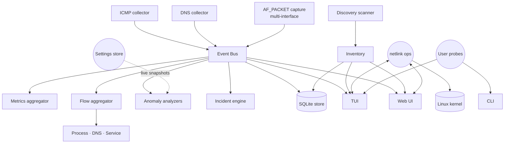
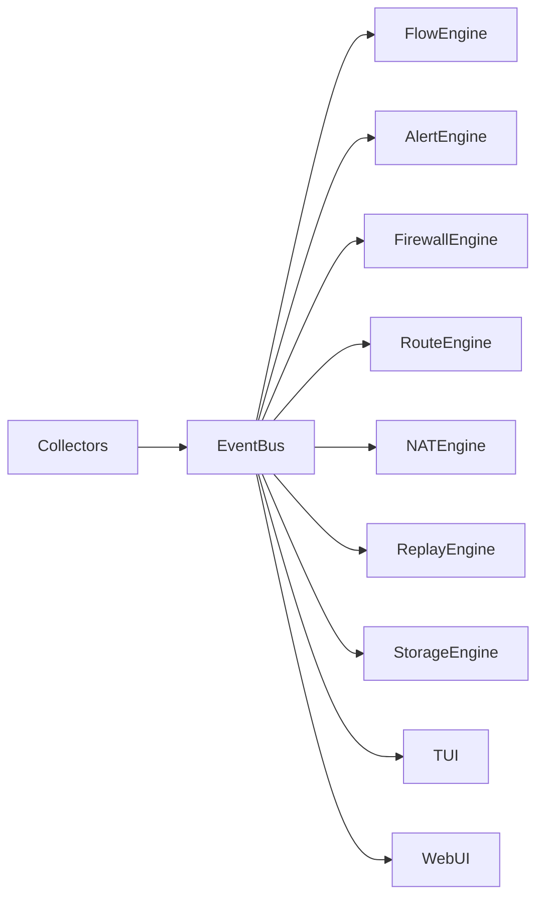
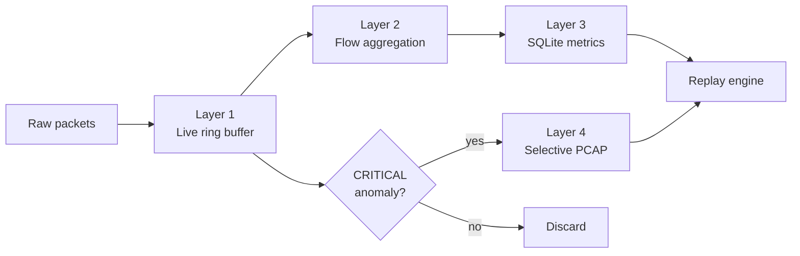
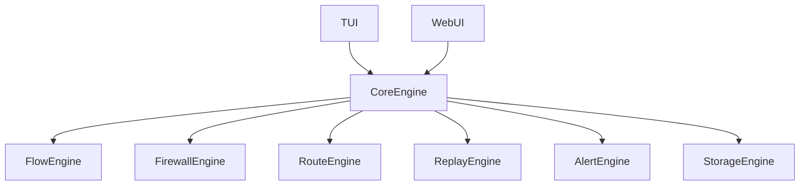

```text
      ___    __________ ________   ______ __________  __   __   _______     ______
 ,,  // \\   \__    __/ |  ____/  /  ___/ \__    __/ |  | |  | |   ___  \  /  __   \
(_,\/ \_/ \     |  |    |  |___   \  \       |  |    |  | |  | |  |   \  \ |  |  |  |
  \ \_/_\_/>    |  |    |   ___|   \  \      |  |    |  | |  | |  |   |  | |  |  |  |
  /_/  /_/      |  |    |  |_____  /  /      |  |    |  |_|  | |  |___/  / |  |__|  |
                |__|    |_______/ /__/       |__|     \_____/  |________/   \______/
```

# Testudo: See Every Packet, Replay Every Incident

**Terminal-native network observability, diagnostics, and Linux network operations - in one Go binary.**

[](https://go.dev/)
[](https://www.kernel.org/)
[](./LICENSE)
[](#)
[](#)

[](https://github.com/charmbracelet/bubbletea)
[](https://github.com/charmbracelet/lipgloss)
[](https://sqlite.org/)
[](https://github.com/google/gopacket)
[](https://github.com/mdlayher/netlink)
[](#)
[](https://netfilter.org/)
[](https://en.wikipedia.org/wiki/Link_Layer_Discovery_Protocol)
[](https://en.wikipedia.org/wiki/Simple_Network_Management_Protocol)
[](https://en.wikipedia.org/wiki/Multicast_DNS)
[](#)
[](https://sentry.io/)
[](https://guacamole.apache.org/)

Testudo gives a Linux operator a complete operational picture of the host networking stack - live and historical - without dragging in `libpcap`, `cgo`, or a separate metrics backend. Live multi-interface flow analytics, anomaly detection, packet replay, firewall and routing control, NAT management, network discovery, and a unified web console - all driven by a single Bubble Tea TUI and mirrored to an embedded HTTP UI.

- **Author**: Noah Zeumer &lt;[github.com/noahzmr](https://github.com/noahzmr)&gt;
- **License**: MPL-2.0 with branding restrictions (see [LICENSE](./LICENSE) and [NOTICE](./NOTICE))
- **Status**: active development, Linux-first (Ubuntu / Debian)

---

## Why It Matters

The typical network-troubleshooting workflow today is a tower of disconnected tools: `tcpdump` for packets, `iftop` for flows, `ss` for sockets, `nmap` for discovery, `iptables` and `nft` for firewall state, `ip` for routes, and a separate Grafana for history. Each one is excellent in isolation. **None of them speak to each other. None of them are replayable.**

Testudo replaces that loose collection with one operational console:

- Stop juggling six terminals when a link starts dropping packets - every signal lives in one TUI.
- Stop wondering "what was the network doing at 03:14?" - sessions are reconstructible from a session ID.
- Stop running always-on `tcpdump` and burning disk - PCAPs are captured only when an anomaly justifies them.
- Stop bolting metrics onto Prometheus + Grafana for a single Linux host - Testudo persists its own time-series to SQLite.
- Stop maintaining two UIs - the TUI and the web UI are the same engine over different transports.

Built around pure-Go netlink, AF_PACKET, and `/proc` parsing. No `cgo`. No external broker. No external metrics backend. One binary, one config, one event bus.

---

## What does "Testudo" mean?

**Testudo** is Latin for **tortoise** - and the word lives in *two* worlds that both describe this tool.

### 1. Biology - the tortoise genus

*Testudo* is the scientific genus name for the palearctic (European) land tortoises. The best-known species are *Testudo hermanni* (Hermann's tortoise) and *Testudo graeca* (the Greek tortoise).

> **The tortoise is slow** - and **slow is exactly the symptom this tool was built to diagnose.**
>
> The reason most operators reach for a packet analyzer in the first place is some variation of *"the network feels slow."* Latency creeping up. DNS taking just a bit too long. A flow that used to be 100 ms now sitting at 400 ms. A retransmission rate that no dashboard surfaces. Testudo is built for those questions: *where* is it slow, *when* did it start being slow, and *what* was the network doing the moment it got slow.

### 2. Military history - the Roman *Testudo* formation

In the legions, a *Testudo* (German: *Schildkrötenformation*) was a tight tactical formation in which soldiers closed ranks and locked their shields together - overhead and on the flanks - to create a gap-free shell that absorbed arrow volleys and falling stones.

That formation maps almost one-to-one onto how Testudo is built:

- **Shell** → a hardened observation layer around the host networking stack.
- **Formation** → many small subsystems (collectors, analyzers, engines) interlocking through one event bus - no single subsystem is exposed alone.
- **Coverage without gaps** → every observable signal (flow, DNS, ICMP, ARP, LLDP, SNMP, firewall, route, NAT) is captured by *some* shield; nothing falls through.
- **Endurance** → low-overhead, replayable, made to run quietly on a box for weeks.

### Mascot

A turtle peeking out from under its shell - half forensic, half cozy. The terminal-native identity is intentional: this is a tool you live inside, not one you click through.

---

## Table of Contents

- [Why It Matters](#why-it-matters)
- [What does "Testudo" mean?](#what-does-testudo-mean)
- [Features](#features)
- [TUI & Web Interface](#tui--web-interface)
- [Architecture](#architecture)
- [System Design Philosophy](#system-design-philosophy)
- [Prerequisites](#prerequisites)
- [Quick Start](#quick-start)
- [Build Instructions](#build-instructions)
- [CLI Reference & Options](#cli-reference--options)
- [Configuration System](#configuration-system)
- [Directory Structure](#directory-structure)
- [Development Guide](#development-guide)
- [Screens](#screens)
- [Roadmap](#roadmap)
- [Contributing](#contributing)
- [License](#license)
- [Branding](#branding)
- [Acknowledgments](#acknowledgments)

---

## Features

### Live Observability

- **ICMP latency, RTT, jitter, packet loss** - per target, with rolling 20-sample statistics.
- **DNS resolver health probing** - per-name latency and failure-rate tracking.
- **Multi-interface AF_PACKET capture** - physical, wireless, VLAN, bridge, tunnel, VPN, container, and virtual interfaces (`eth0`, `wlan0`, `tun0`, `wg0`, `docker0`, `br0`, …).
- **Process-to-flow correlation** - via `/proc/net/*` and `/proc/<pid>/fd` - every flow is tagged with the process that owns it.
- **DNS reverse correlation** - flows are annotated with the name that originally resolved to the far end.
- **Service catalog** - well-known ports mapped to protocol names (HTTP, HTTPS, SSH, DNS, NTP, MySQL, PostgreSQL, Redis, and more).
- **Interface throughput accounting** - RX and TX per direction, per interface.

### Flow Engine

The flow engine aggregates packets into intelligent flow summaries rather than persisting raw packets, and enriches each flow with process ownership, DNS resolution, service classification, and NAT/firewall state.

```text
┌ Live Flows ─────────────────────────────────────────┐
│ IFACE    PROCESS   SRC               DST           │
│ eth0     firefox   192.168.1.20      youtube.com   │
│ wg0      ssh       10.0.0.10         10.0.0.1      │
│ docker0  redis     172.18.0.2        172.18.0.5    │
└─────────────────────────────────────────────────────┘
```

Tracked per flow: source/destination, ports, protocol, throughput, retransmissions, packet loss, ingress interface, egress interface, process ownership, NAT state, firewall state.

### Network Discovery

Testudo runs **layered discovery** - passive listeners are always on when discovery is enabled; active probes are opt-in. The goal is "find every reachable device on every connected subnet, even the ones that drop ICMP."

```text
┌ Devices ─────────────────────────────────────────────────────────────┐
│ HOSTNAME       IP             TYPE       SOURCE        STATUS        │
│ router.local   192.168.1.1    Router     lldp+snmp     Active        │
│ sw-core-01     192.168.1.2    Switch     lldp          Active        │
│ ap-floor3      192.168.1.5    AP         lldp          Active        │
│ nas01          192.168.1.10   NAS        snmp          Active        │
│ printer01      192.168.1.40   Printer    arp-sweep     Idle          │
│ ?              192.168.1.77   Unknown    arp-sweep     Active        │
└──────────────────────────────────────────────────────────────────────┘
```

Each device is tracked with IP, MAC, hostname, vendor (via embedded OUI table), interface, source, device type, first/last-seen timestamps, and - for managed gear - system name, description, object ID, contact, location, uptime, interface count, LLDP chassis/port IDs and capabilities.

**Discovery layers (latest optimization pass):**

| Layer         | Mode       | What it does                                                                                                                           | Cost     |
| ------------- | ---------- | -------------------------------------------------------------------------------------------------------------------------------------- | -------- |
| ARP cache     | Passive    | Reads `/proc/net/arp` every tick - zero traffic.                                                                                       | None     |
| Flow observe  | Passive    | Every new flow contributes endpoint visibility.                                                                                        | None     |
| LLDP listen   | Passive    | AF_PACKET listener on ethertype `0x88cc` - neighbours announce themselves; ideal for switches/APs/phones.                              | None     |
| **ARP sweep** | **Active** | **Broadcast ARP for every host in every connected /22 - catches ping-shy devices that ICMP misses.**                                   | One-shot |
| ICMP sweep    | Active     | Echo to each host in the local subnets (capped by `--max-subnet-bits`).                                                                | One-shot |
| **SNMPv2c**   | **Active** | **Hand-rolled BER GET on UDP/161 - pulls `sysName`, `sysDescr`, `sysObjectID`, `sysContact`, `sysLocation`, `sysUpTime`, `ifNumber`.** | Bounded  |
| mDNS query    | Active     | One-shot `_services._dns-sd._udp.local` query for service-advertising hosts.                                                           | One-shot |
| TCP/UDP probe | Active     | Targeted port probes - service hints (HTTP, SSH, SMB, …).                                                                              | Targeted |
| NetBIOS       | Active     | NetBIOS name-service query for legacy Windows hosts.                                                                                   | Targeted |

**Why this layout matters:**

- **ARP sweep is the single biggest coverage win.** ICMP echo is dropped by a long tail of consumer devices (Windows firewall defaults, IoT silence, "ping-shy" servers); ARP, by contrast, *has to* answer for the host to be reachable on the LAN. The ARP sweep is parallelized across interfaces and capped at `/20` (4096 hosts) so a misconfigured `/16` doesn't generate 64k frames in one tick.
- **LLDP gives free identification.** When a directly-connected switch or AP speaks LLDP, you get its chassis ID, port description, system name, system description and capabilities - without sending a single packet.
- **SNMPv2c reaches managed gear that doesn't speak LLDP.** The probe is hand-rolled (~250 lines, no external dependency) and runs with **bounded concurrency** plus a per-host timeout (default 1 s) so SNMP-dark hosts don't stall the sweep.
- **Subnet expansion is capped.** `MaxSubnetBits = 10` (default) gives `/22 = 1024 hosts`. Set to `8` for strict `/24` behaviour, or `12` for `/20`. Anything wider is silently skipped to avoid burying the local NIC.
- **Per-interface goroutine isolation.** Each interface gets its own listener goroutine; a stuck or erroring interface can't starve the others.

### Interface Management

Interfaces can be enabled, disabled, switched to DHCP, assigned static IPs, gateways, and DNS servers - directly from the TUI or web UI.

```text
┌ Interfaces ─────────────────────────────┐
│ eth0                                    │
│ Status:  UP                             │
│ Mode:    DHCP                           │
│ IPv4:    192.168.1.20/24                │
│ Gateway: 192.168.1.1                    │
│ RX: 122 MB/s     TX: 12 MB/s            │
└─────────────────────────────────────────┘
```

### Firewall Management

Current backend: `iptables` / `nftables`. `firewalld` support is on the roadmap.

Supported operations: inspect rules, inspect counters, inspect blocked traffic, hit counts, create rules, remove rules, replay firewall events.

```text
┌ Firewall Rules ─────────────────────────────────────┐
│ Chain: INPUT                                        │
│ DROP tcp -- 0.0.0.0/0 -> 22/tcp                     │
│ Hits: 1221                                          │
│ Blocked Traffic: 82 MB                              │
└─────────────────────────────────────────────────────┘
```

### Routing Management

Inspect routing tables, add static routes, remove routes, and replay route changes from the historical log.

```text
┌ Static Routes ──────────────────────────────────────┐
│ 10.0.0.0/24    via 192.168.1.1   dev eth0          │
│ 172.16.0.0/16  via 10.0.0.1      dev tun0          │
└─────────────────────────────────────────────────────┘
```

### NAT & Port Forwarding

Create and remove port forwards, inspect NAT and masquerading rules, and observe forwarding counters.

```text
┌ NAT Rules ──────────────────────────────────────────┐
│ DNAT tcp 0.0.0.0:443 -> 192.168.1.10:443           │
│ Hits: 8421                                          │
│ Forwarded: 12.4 GB                                  │
└─────────────────────────────────────────────────────┘
```

### Anomaly Detection & Alerting

A continuous analysis engine watches latency, jitter, packet loss, DNS timing, retransmissions, firewall drops, route instability, bandwidth spikes, and NAT exhaustion. Anomalies are routed to a four-level severity ladder.

| Level    | Meaning            |
| -------- | ------------------ |
| INFO     | Informational      |
| WARN     | Degraded condition |
| ERROR    | Operational issue  |
| CRITICAL | Severe degradation |

```text
┌ Alerts ─────────────────────────────────────────────┐
│ [WARN] DNS latency exceeded threshold              │
│ [CRIT] Packet loss burst detected                  │
│ [INFO] Route changed on eth0                       │
│ [WARN] Firewall rule dropping excessive traffic    │
└─────────────────────────────────────────────────────┘
```

CRITICAL anomalies trigger the **incident engine**, which snapshots context (top flows, route state, firewall state, recent metrics) into a JSON bundle for forensic replay.

### Replay Engine

Replay mode reconstructs past sessions from persisted metrics, flows, alerts, and route/firewall snapshots.

```bash
testudo replay session-2026-05-23
```

Timeline navigation, flow replay, DNS replay, firewall replay, route replay, NAT replay, topology replay, and full incident reconstruction. Example timeline:

```text
19:42:11  Session started
19:44:02  WARN     DNS latency spike
19:44:15  WARN     Upload saturation
19:44:18  CRITICAL Packet loss burst
19:44:21  ERROR    Firewall drops increasing
```

### Selective PCAP Capture

Raw packets are not persisted by default. Captures are triggered selectively by anomaly events - packet loss bursts, firewall anomalies, DNS failures, retransmission spikes, route instability, NAT exhaustion - and rotated according to retention policy. There is **no always-on full-capture mode** by design.

### TUI Visualizations

- Latency timelines
- Packet-loss heatmaps
- Throughput graphs
- Protocol-distribution graphs
- Alert timelines
- Firewall hit charts
- Flow-activity graphs

```text
Latency Timeline

▁▁▂▂▃▄▅▆▇▆▅▄▃▂▁
```

### Web Interface

The web UI mirrors every TUI view: dashboard, flows, devices, interfaces, routes, firewall, NAT, alerts, settings. Authentication uses bcrypt-hashed credentials stored locally; sessions are cookie-based with an 8-hour TTL. Default user: `testudo` (rotate with `testudo user passwd`).

### Integrations

- **Sentry** - optional, DSN-gated panic and error reporting.
- **Apache Guacamole** - URL deep-link helper for SSH/RDP/VNC handoff from the discovered device inventory.

---

## TUI & Web Interface

The TUI is the canonical interface. The web UI is the same data, the same engine, exposed over HTTP for operators running Testudo on a headless box. Both surface the same tabs:

| Tab        | Purpose                                                                 |
| ---------- | ----------------------------------------------------------------------- |
| Dashboard  | Aggregate health, latency sparkline, current alert state                |
| Flows      | Live multi-interface flow table with process / DNS / service enrichment |
| Devices    | Discovered devices, vendor, type, last seen                             |
| Interfaces | Per-interface status, mode, IP, gateway, RX/TX, controls                |
| Routes     | Routing tables, route timeline, add/remove                              |
| Firewall   | iptables/nftables rule view, hit counters, add/remove                   |
| NAT        | NAT and port-forwarding rules with counters                             |
| Alerts     | Live alert log, severity filter, replay link                            |
| Replay     | Session browser and timeline scrubber                                   |
| Settings   | Live-tunable thresholds, retention, integrations                        |

Modal configuration is supported in both UIs for firewall rules, NAT rules, port forwarding, interface configuration, route configuration, and alert configuration.

```text
┌ Add Firewall Rule ────────────────────────────────┐
│ Chain:      INPUT                                 │
│ Protocol:   TCP                                   │
│ Port:       443                                   │
│ Action:     ACCEPT                                │
│                                                   │
│ [ Save ]        [ Cancel ]                        │
└───────────────────────────────────────────────────┘
```

---

## Architecture

### Runtime Architecture



### Event-Driven Architecture



Every subsystem speaks to one another exclusively through the event bus. There are no direct cross-module calls in the data plane. This isolation is what makes replay possible: a session is reconstructed by feeding persisted events back into the same bus.

### Storage Pipeline



### Unified UI Architecture



The TUI and the web UI are siblings. They consume snapshots from the same core engine, which means a feature shipped in one is automatically available in the other.

---

## System Design Philosophy

Testudo is built around ten principles that constrain every implementation decision:

1. **Live-first observability.** The default mode is live. Historical analysis is layered on top, not the other way around.
2. **Historical replayability.** Anything you can observe live, you can reconstruct after the fact from a session ID.
3. **Flow aggregation over packet storage.** Raw packets are ephemeral. Flow summaries are what get persisted.
4. **Selective PCAP capture.** Raw packets are kept only when an anomaly justifies it. There is no "always-on full capture" mode by design.
5. **Event-driven processing.** All subsystems talk through one event bus. No direct cross-module data-plane calls.
6. **Low-overhead operation.** Rolling buffers, bounded queues, compressed time-series, no unbounded memory growth.
7. **Linux-first architecture.** Pure-Go netlink, AF_PACKET, `/proc` parsing. No `cgo`, no `libpcap`, no external metrics backend required.
8. **Terminal-first interaction.** The TUI is the canonical interface. The web UI mirrors it; it does not extend it.
9. **Reproducible diagnostics.** Every probe and every operator action is captured as an event for later inspection.
10. **Modular subsystem isolation.** A subsystem can be removed or replaced without touching another subsystem's code.

### Storage Layers

The storage pipeline has four layers, each one less volatile than the last:

| Layer | Medium          | Lifetime              | Purpose                                  |
| ----- | --------------- | --------------------- | ---------------------------------------- |
| 1     | In-memory ring  | Seconds to minutes    | Live rendering, instant anomaly replay   |
| 2     | Flow aggregator | Minutes to hours      | Active flow tracking, enriched summaries |
| 3     | SQLite          | Days to months        | Metrics, alerts, route/firewall history  |
| 4     | Selective PCAP  | Days (incident-bound) | Forensic packet evidence                 |

A typical `FlowSummary` looks like:

```go
type FlowSummary struct {
    Interface   string
    SrcIP       string
    DstIP       string
    Protocol    string
    BytesIn     uint64
    BytesOut    uint64
    AvgLatency  float64
    PacketLoss  float64
    DNSName     string
    ProcessName string
}
```

---

## Prerequisites

Before building or running Testudo, ensure you have:

- **Go**: 1.25 or newer
- **OS**: Linux (Ubuntu / Debian recommended; Fedora, Arch, openSUSE on the roadmap)
- **Kernel privileges**: `CAP_NET_RAW` and `CAP_NET_ADMIN` on the resulting binary (or run as root - not recommended)
- **Disk**: a few hundred MB for SQLite session history and incident-triggered PCAPs
- **Optional**: a Sentry DSN for crash reporting, an Apache Guacamole instance for SSH/RDP/VNC handoff

Testudo is **pure Go**. There is no `cgo` dependency, no `libpcap`, no `libsqlite3`. A clean machine needs only the Go toolchain to build.

---

## Quick Start

1. **Clone**:

   ```bash
   git clone https://github.com/noahzmr/testudo.git
   cd testudo
   ```

2. **Build, mark executable, and install system-wide** - one line that puts `testudo` on your `$PATH`:

   ```bash
   go build -o testudo ./cmd/testudo && chmod +x testudo && sudo mv testudo /usr/local/bin/
   ```

3. **Grant capabilities** (one-time, after install):

   ```bash
   sudo setcap cap_net_raw,cap_net_admin=+ep /usr/local/bin/testudo
   ```

4. **Run from anywhere** in your terminal:

   ```bash
   testudo                              # live TUI, default targets, no capture
   testudo live --capture               # add multi-interface capture
   testudo web                          # start the HTTP UI on 127.0.0.1:8080
   testudo discover --active --lldp     # one-shot layered network scan
   testudo replay session-2026-05-23    # open a past session in replay mode
   ```

5. **Log in to the web UI** (if started). On the first `testudo web` invocation the server provisions a default user `testudo` with a freshly-generated random password printed once to stderr. Rotate it any time with:

   ```bash
   testudo user passwd
   ```

---

## Build Instructions

### Build

```bash
go build -o testudo ./cmd/testudo
```

### Run from source

```bash
go run ./cmd/testudo
```

### Install system-wide

Drop the binary into a directory that's already on your `$PATH` so you can call `testudo` from any shell:

```bash
go build -o testudo ./cmd/testudo \
  && chmod +x testudo \
  && sudo mv testudo /usr/local/bin/
```

Verify:

```bash
which testudo            # /usr/local/bin/testudo
testudo --version
```

### Grant Capabilities (one-time, after install)

```bash
sudo setcap cap_net_raw,cap_net_admin=+ep /usr/local/bin/testudo
```

| Capability      | Used for                                                                          |
| --------------- | --------------------------------------------------------------------------------- |
| `CAP_NET_RAW`   | Raw ICMP, AF_PACKET capture, ARP sweep, LLDP listener, traceroute, ICMP discovery |
| `CAP_NET_ADMIN` | Netlink writes, nftables, promisc-mode interface configuration                    |

Verify:

```bash
getcap /usr/local/bin/testudo
# /usr/local/bin/testudo cap_net_admin,cap_net_raw=ep
```

### Uninstall

```bash
sudo rm /usr/local/bin/testudo
```

### Cross-compile

Testudo is pure Go and cross-compiles cleanly to any `GOOS=linux` target:

```bash
GOOS=linux GOARCH=amd64 go build -o testudo-linux-amd64 ./cmd/testudo
GOOS=linux GOARCH=arm64 go build -o testudo-linux-arm64 ./cmd/testudo
```

### Tests

```bash
go test ./...
```

---

## CLI Reference & Options

```bash
testudo <subcommand> [flags]
```

| Subcommand     | Description                                             |
| -------------- | ------------------------------------------------------- |
| `live`         | Launch the live TUI (default if no subcommand is given) |
| `web`          | Start the HTTP UI                                       |
| `sessions`     | List recorded replay sessions                           |
| `replay <id>`  | Open a replay session                                   |
| `ifaces`       | List interfaces and their state                         |
| `routes`       | Show the routing table                                  |
| `nat list`     | List NAT and port-forwarding rules                      |
| `discover`     | One-shot network scan                                   |
| `probe <host>` | Diagnostic probe against a host                         |
| `user passwd`  | Rotate the local web-UI password                        |

### Common flags

| Flag                      | Default                    | Description                                                                             |
| ------------------------- | -------------------------- | --------------------------------------------------------------------------------------- |
| `--capture`               | off                        | Enable multi-interface AF_PACKET capture                                                |
| `--iface=<csv>`           | auto-discover              | Capture only on the named interfaces (e.g. `wlp1s0,wg0`)                                |
| `--exclude-iface=<csv>`   | none                       | Skip the named interfaces during auto-discovery                                         |
| `--allow-netops-write`    | off                        | Permit route/interface/NAT writes from the TUI                                          |
| `--listen=<addr>`         | `127.0.0.1:8080`           | Web UI listen address (`web` subcommand)                                                |
| `--active`                | off                        | Active discovery - ARP broadcast sweep + ICMP sweep + mDNS query + SNMPv2c (`discover`) |
| `--lldp`                  | on                         | Passive LLDP listener for directly-connected neighbours (`discover`)                    |
| `--snmp-community=<str>`  | `public`                   | SNMPv2c read community; empty string disables SNMP (`discover`)                         |
| `--snmp-timeout=<dur>`    | `1s`                       | Per-host SNMP UDP/161 deadline (`discover`)                                             |
| `--max-subnet-bits=<int>` | `10`                       | Cap subnet expansion for active sweeps; 10 = /22 = 1024 hosts (`discover`)              |
| `--wait=<dur>`            | `6s`                       | Discovery dwell time / LLDP listen window (`discover`)                                  |
| `--config=<path>`         | `~/.testudo/settings.json` | Override the persistent settings path                                                   |
| `--log-level=<level>`     | `info`                     | `debug` / `info` / `warn` / `error`                                                     |
| `--no-color`              | off                        | Disable ANSI color in the TUI                                                           |
| `--version`               | -                          | Print version and exit                                                                  |
| `--help`                  | -                          | Print help and exit                                                                     |

### Examples

```bash
testudo                                       # live TUI, default targets, no capture
testudo live --capture                        # add multi-interface capture (auto-discover)
testudo live --iface=wlp1s0,wg0               # capture on specific interfaces
testudo live --allow-netops-write             # permit route/interface/NAT writes from TUI
testudo web --listen=0.0.0.0:8443             # bind the web UI to all interfaces
testudo discover --active --lldp --wait 8s    # full layered scan: ARP sweep + ICMP + mDNS + SNMP + LLDP
testudo discover --snmp-community=monitoring  # SNMPv2c probe with a non-default community
testudo discover --max-subnet-bits=8          # restrict active sweeps to /24
testudo replay session-2026-05-23             # open a past session in replay mode
```

---

## Configuration System

Testudo ships with intelligent defaults. Every threshold is live-tunable from the Settings tab in the TUI, from the Settings panel in the web UI, and from the persisted config file at `~/.testudo/settings.json`.

### Anomaly Thresholds

| Setting           | Default | Description                                      |
| ----------------- | ------- | ------------------------------------------------ |
| Packet loss       | 2 %     | Rolling 20-sample loss percentage                |
| DNS latency       | 120 ms  | Per-query DNS warning threshold                  |
| Jitter            | 20 ms   | Mean RTT delta over the last 20 samples          |
| RTT               | 150 ms  | Single-sample ICMP round-trip warning            |
| Retransmissions   | 5 %     | TCP retransmission warning threshold             |
| Incident cooldown | 60 s    | Minimum seconds between incident bundle triggers |

### Retention & Capture

| Setting              | Default       | Description                              |
| -------------------- | ------------- | ---------------------------------------- |
| Replay retention     | 30 days       | Session metrics kept in SQLite           |
| PCAP retention       | 7 days        | Incident-triggered PCAP rotation horizon |
| Smart PCAP capture   | enabled       | Trigger captures from CRITICAL anomalies |
| Capture interfaces   | auto-discover | Comma-separated interface override       |
| Interface exclusions | none          | Interfaces to skip during auto-discovery |

### Discovery

| Setting                  | Default  | Description                                                                               |
| ------------------------ | -------- | ----------------------------------------------------------------------------------------- |
| `DiscoveryEnabled`       | true     | Master toggle for the discovery scanner (passive listeners + scheduler)                   |
| `DiscoveryActive`        | false    | Enable active probes: ARP broadcast sweep, ICMP sweep, mDNS query, SNMPv2c GET            |
| `DiscoveryInterval`      | 60 s     | Cadence of one discovery round                                                            |
| `DiscoveryMaxSubnetBits` | 10       | Prefix-expansion cap; 10 = /22 (1024 hosts), 8 = /24, 12 = /20, wider is silently skipped |
| `LLDPEnabled`            | true     | Passive LLDP listener (needs `CAP_NET_RAW`; soft-fails per interface when missing)        |
| `SNMPCommunity`          | `public` | SNMPv2c read community; empty string disables SNMP probing entirely                       |
| `SNMPTimeout`            | 1 s      | Per-host SNMP UDP/161 deadline                                                            |

### Integrations

| Setting        | Default | Description                         |
| -------------- | ------- | ----------------------------------- |
| Sentry DSN     | unset   | Enable Sentry panic/error reporting |
| Guacamole base | unset   | Base URL for the Guacamole instance |

### Settings View

```text
┌ Settings ───────────────────────────────────────────┐
│ Packet Loss Threshold:     2 %                     │
│ DNS Warning Threshold:     120 ms                  │
│ Replay Retention:          30 days                 │
│ Smart PCAP Capture:        Enabled                 │
└─────────────────────────────────────────────────────┘
```

---

## Directory Structure

```text
testudo/
├── cmd/
│   └── testudo/                ← CLI entry point + subcommand registry
├── internal/
│   ├── tui/                    ← Bubble Tea TUI
│   ├── web/                    ← HTTP UI + embedded assets
│   ├── engine/                 ← lifecycle orchestrator
│   ├── events/                 ← event bus + severity ladder
│   ├── collectors/             ← ICMP, DNS probes
│   ├── capture/                ← multi-interface AF_PACKET
│   ├── flows/                  ← flow aggregator + correlators
│   ├── analyzers/              ← anomaly detectors
│   ├── alerts/                 ← alert log + severity escalation
│   ├── firewall/               ← iptables / nftables
│   ├── routes/                 ← routing table ops
│   ├── nat/                    ← NAT + port forwarding
│   ├── discovery/              ← ARP / ICMP / mDNS scanner
│   ├── interfaces/             ← interface enumeration & control
│   ├── metrics/                ← rolling per-target stats
│   ├── replay/                 ← session reconstruction
│   ├── storage/                ← SQLite persistence
│   ├── integrations/
│   │   ├── sentry/             ← optional panic reporting
│   │   └── guacamole/          ← SSH/RDP/VNC deep-link helper
│   └── config/                 ← defaults + persistent settings
├── storage/
│   ├── captures/               ← incident-triggered PCAP (gitignored)
│   ├── metrics/                ← downsampled metrics export
│   └── sessions/               ← per-session artifacts
├── docs/
│   └── images/                 ← screenshots referenced in README
├── README.md
├── DEVELOPER.md
├── LICENSE
├── NOTICE
├── COPYRIGHT_HEADER.txt
├── go.mod
└── go.sum
```

---

## Development Guide

### Module Overview

| Package                           | Responsibility                                                      |
| --------------------------------- | ------------------------------------------------------------------- |
| `internal/tui`                    | Bubble Tea application - tabs, modals, browser, replay UI           |
| `internal/web`                    | HTTP UI, embedded assets, sessions, snapshot endpoint               |
| `internal/engine`                 | Lifecycle orchestrator - wires all subsystems together              |
| `internal/events`                 | Non-blocking fan-out event bus, four-level severity                 |
| `internal/collectors`             | ICMP and DNS probes                                                 |
| `internal/capture`                | Multi-interface AF_PACKET capture                                   |
| `internal/flows`                  | Interface-tagged five-tuple aggregator, correlators                 |
| `internal/firewall`               | iptables / nftables observation and management                      |
| `internal/nat`                    | NAT rule management and port-forward bookkeeping                    |
| `internal/routes`                 | Routing table observation and management                            |
| `internal/discovery`              | ARP, ICMP, mDNS scanner with device inventory                       |
| `internal/alerts`                 | Anomaly detector pipeline, severity escalation, alert log           |
| `internal/replay`                 | Session reconstruction from persisted events                        |
| `internal/storage`                | SQLite persistence (sessions, samples, flows, anomalies, incidents) |
| `internal/integrations/sentry`    | Optional panic/error reporting                                      |
| `internal/integrations/guacamole` | URL deep-link helper for SSH/RDP/VNC handoff                        |
| `internal/config`                 | Defaults, thresholds, persistent settings store                     |
| `cmd/testudo`                     | Command-line entry point and subcommand registry                    |

### Coding Standards

- **Avoid global state.** All subsystem state is owned by a struct and passed explicitly.
- **`context.Context` everywhere.** Every cancellable operation accepts a context as its first argument.
- **Channels over locks.** Coordination uses channels; locks are reserved for short, contended critical sections.
- **Never block the render loop.** The TUI render goroutine must remain responsive; analysis runs on workers.
- **Isolated analyzers.** Each anomaly detector is a self-contained unit that consumes events and emits anomalies.
- **Modular subsystems.** A subsystem should be removable without touching another subsystem's code.
- **Structured logging.** Every log line is structured key/value, never freeform text.

### Performance Rules

- Never render raw packets directly to the UI.
- Minimize allocations on hot paths (capture, aggregation, event dispatch).
- Use rolling buffers with fixed capacity for live data.
- Compress historical metrics before persisting.
- Avoid unbounded memory growth - every buffer has a documented ceiling.
- Process asynchronously where possible; the event bus is the synchronization point.

### Event-Driven Flow

Every observable signal in Testudo travels the same path:

```text
Collector ──► EventBus ──► Subscribers ──► (UI, Storage, Analyzers, Replay)
```

A subscriber never calls back into a collector. If a subscriber needs to act on the network, it emits an `OpsRequest` event and a netops subsystem handles it. This keeps the data plane and the control plane cleanly separated.

For the full developer walkthrough - adding subsystems, release process, test conventions - see [DEVELOPER.md](./DEVELOPER.md).

---

## Screens


---

## Roadmap

**Legend**

| Symbol | Meaning               |
| ------ | --------------------- |
| +      | New feature           |
| !      | Infrastructure change |
| #      | UI/Visualization      |

### v0.2 - Distribution & Backends

- `+` `firewalld` backend alongside `iptables` / `nftables`
- `+` Fedora and openSUSE packaging
- `!` Arch Linux build artifacts in CI
- `#` Theme presets for the web UI

### v0.3 - Forensic Depth

- `+` Per-flow PCAP slicing during incident bundles
- `+` Topology diff between replay sessions
- `#` Incident overlay on the dashboard sparkline
- `!` Compressed metrics export format (zstd)

### v0.4 - Distributed Operation

- `+` Multi-host session aggregation
- `+` Read-only federation for the web UI
- `!` Optional remote PostgreSQL backend for long-horizon retention
- `#` Cross-host topology view

### v1.0 - Production Hardening

- `+` IPv6 parity across discovery and firewall modules
- `!` Long-running stability soak harness
- `#` Operator-mode keybinding overlay in the TUI
- `+` Stable plugin API for third-party collectors

---

## Contributing

Contributions are welcome. The [Development Guide](#development-guide) above and the philosophy in [.claude/CLAUDE.md](./.claude/CLAUDE.md) describe how the project is organized and what kinds of changes fit its design.

The short version:

1. Fork the repository and create a feature branch.
2. Add or extend a subsystem under `internal/` - keep it removable.
3. Wire it into the event bus, not into another subsystem.
4. Include tests under the same package (`*_test.go`).
5. Run `go test ./...` and `go vet ./...` before opening a PR.
6. Stamp every new source file with the standard header from [COPYRIGHT_HEADER.txt](./COPYRIGHT_HEADER.txt).
7. Open a PR with a focused description; small PRs land faster than sweeping ones.

Contributions are accepted under the same MPL-2.0 license as the rest of the project.

---

## License

Testudo is distributed under the **Mozilla Public License Version 2.0** ([LICENSE](./LICENSE)), with additional branding restrictions documented in [NOTICE](./NOTICE).

Copyright (c) 2026 Noah Zeumer.

### Why MPL-2.0

MPL-2.0 was chosen deliberately. It strikes the balance Testudo needs:

- **File-level copyleft.** Modifications to MPL-licensed files must remain open under the same license, but linking Testudo against proprietary code is permitted. This keeps the core honest without making the project hostile to commercial adopters.
- **Commercial use is welcome.** Companies can deploy, modify, and ship Testudo internally or as part of larger commercial offerings.
- **Modifications stay visible.** Anyone who improves an MPL-licensed file must publish the modified source - bug fixes and improvements flow back to the community.
- **Compatible with permissive ecosystems.** MPL-2.0 plays well with Apache-2.0 and BSD-licensed dependencies, which makes up most of the Go ecosystem.

### What You Can Do

- Use Testudo in production, including commercial deployments.
- Modify the source code for your own needs.
- Fork the repository.
- Redistribute the source or compiled binaries.
- Build derivative works.
- Contribute changes back upstream.

### What You Cannot Do

- Remove the Testudo branding, ASCII banner, or attribution from forks or redistributions.
- Re-release Testudo under a different product name as if it were a new project.
- Strip the `NOTICE` file or its branding clauses.
- Misrepresent authorship of the original work.
- Remove copyright headers from individual source files.

The code license and the branding restrictions are deliberately separated: MPL-2.0 governs the code, the `NOTICE` file governs the brand. Read both before forking.

---

## Branding

The name **Testudo**, the ASCII logo, and the project identity are property of Noah Zeumer and are not granted under the MPL-2.0 source-code license. The full branding terms - including what attribution is required when redistributing, when a derivative work must be renamed, and how the ASCII banner may and may not be reused - are documented in [NOTICE](./NOTICE).

In short: **fork freely, modify freely, redistribute freely. If you ship a substantively different product, give it a different name.**

---

## Acknowledgments

Testudo stands on the shoulders of giants in the Go and Linux ecosystems:

- **[Bubble Tea](https://github.com/charmbracelet/bubbletea)** - the Elm-inspired TUI runtime that drives the terminal interface.
- **[Lip Gloss](https://github.com/charmbracelet/lipgloss)** - styling and layout for the TUI.
- **[gopacket](https://github.com/google/gopacket)** - packet decoding for the AF_PACKET capture pipeline.
- **[mdlayher/netlink](https://github.com/mdlayher/netlink)** and **[vishvananda/netlink](https://github.com/vishvananda/netlink)** - pure-Go netlink for `cgo`-free kernel interaction.
- **[google/nftables](https://github.com/google/nftables)** - the nftables backend for the firewall subsystem.
- **AF_PACKET, netfilter, conntrack, and `/proc`** - the Linux primitives that make any of this possible.
- **IEEE 802.1AB (LLDP)** and **SNMPv2c** - the open standards that let Testudo identify managed devices without sending a probe.
- **[modernc.org/sqlite](https://gitlab.com/cznic/sqlite)** - pure-Go SQLite, the embedded persistence backend.
- **Sentry** and **Apache Guacamole** - optional integrations for crash reporting and console handoff.

And to every operator who has stared at six terminals during an incident and thought *"there has to be a better way"* - this is for you.
