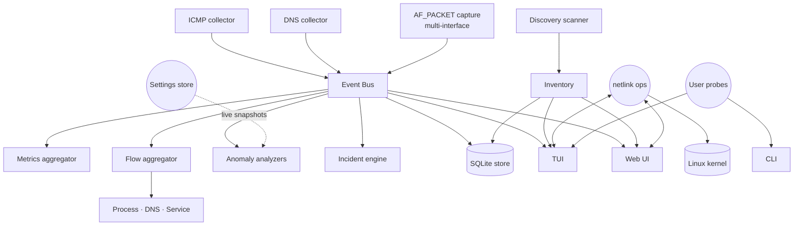
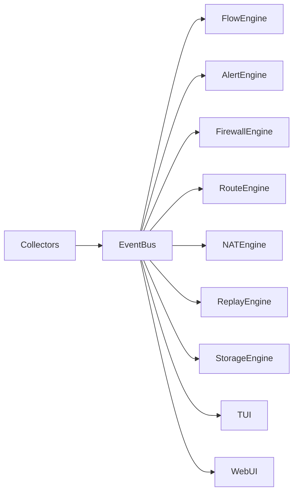
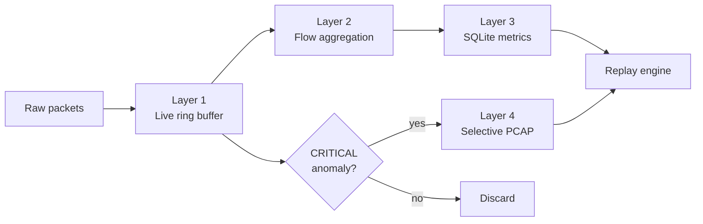
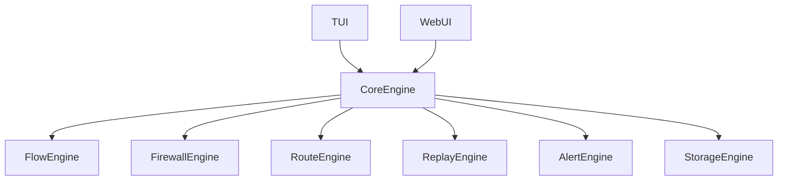

```text
      ___    __________ ________   ______ __________  __   __   _______     ______
 ,,  // \\   \__    __/ |  ____/  /  ___/ \__    __/ |  | |  | |   ___  \  /  __   \
(_,\/ \_/ \     |  |    |  |___   \  \       |  |    |  | |  | |  |   \  \ |  |  |  |
  \ \_/_\_/>    |  |    |   ___|   \  \      |  |    |  | |  | |  |   |  | |  |  |  |
  /_/  /_/      |  |    |  |_____  /  /      |  |    |  |_|  | |  |___/  / |  |__|  |
                |__|    |_______/ /__/       |__|     \_____/  |________/   \______/
```

# Testudo

**Terminal-native network observability, diagnostics, and Linux network operations platform.**

Live multi-interface flow analytics, anomaly detection, packet replay, firewall and routing control, NAT management, network discovery, and a unified web console — written in pure Go and built around a Bubble Tea TUI.

- **Author**: Noah Zeumer &lt;[github.com/noahzmr](https://github.com/noahzmr)&gt;
- **Created**: 2026-05-24
- **Last updated**: 2026-05-24
- **License**: MPL-2.0 with branding restrictions (see [LICENSE](./LICENSE) and [NOTICE](./NOTICE))

---

## Table of Contents

- [Overview](#overview)
- [Feature Set](#feature-set)
- [Architecture](#architecture)
- [System Design Philosophy](#system-design-philosophy)
- [Build Instructions](#build-instructions)
- [Quick Start](#quick-start)
- [Development Guide](#development-guide)
- [Directory Structure](#directory-structure)
- [Configuration System](#configuration-system)
- [Screens](#screens)
- [License](#license)
- [Branding](#branding)
- [Contributing](#contributing)

---

## Overview

Testudo is a single binary that gives an operator a complete operational picture of a Linux host's networking stack — live and historical — without dragging in `libpcap`, `cgo`, or a separate metrics backend.

It exists because the typical network troubleshooting workflow today is a stack of unrelated tools: `tcpdump` for packets, `iftop` for flows, `ss` for sockets, `nmap` for discovery, `iptables` and `nft` for firewall state, `ip` for routes, and a separate Grafana for history. Each one is excellent in isolation. None of them speak to each other, and none of them are replayable.

Testudo replaces that loose collection with one operational console. Every observable signal — flows, latency, DNS, route changes, firewall hits, NAT counters, anomalies, alerts — flows through one event bus, is rendered live in the TUI, mirrored to a web UI, persisted to SQLite, and replayable from a session ID.

The TUI is the primary interface. The Web UI is the same data, the same engine, the same backend — exposed over HTTP for operators who want to run Testudo on a headless box and watch it from a browser.

The platform is Linux-first. Ubuntu and Debian-derivative distributions are the supported targets today; Fedora, Arch, and openSUSE support is on the roadmap.

---

## Feature Set

### Live Observability

- ICMP latency, RTT, jitter, packet loss — per target, with rolling statistics
- DNS resolver health probing — per name latency, failure rate
- Multi-interface AF_PACKET flow capture (physical, wireless, VLAN, bridge, tunnel, VPN, container, virtual)
- Process-to-flow correlation via `/proc/net/*` and `/proc/<pid>/fd`
- DNS reverse correlation — flows are annotated with the name that resolved to the far end
- Service catalog mapping well-known ports to protocol names (HTTP, HTTPS, SSH, DNS, NTP, MySQL, PostgreSQL, Redis, and more)
- Interface throughput accounting per direction

### Flow Engine

The flow engine is one of Testudo's core subsystems. It aggregates packets into intelligent flow summaries rather than persisting raw packets, and enriches each flow with process ownership, DNS resolution, service classification, and NAT/firewall state.

```text
┌ Live Flows ─────────────────────────────────────────┐
│ IFACE    PROCESS   SRC               DST           │
│ eth0     firefox   192.168.1.20      youtube.com   │
│ wg0      ssh       10.0.0.10         10.0.0.1      │
│ docker0  redis     172.18.0.2        172.18.0.5    │
└─────────────────────────────────────────────────────┘
```

### Network Discovery

Passive discovery reads ARP caches and observes flow telemetry without sending packets. Active discovery (opt-in) adds ICMP sweeps across local subnets and a single mDNS service query.

```text
┌ Devices ────────────────────────────────────────────┐
│ HOSTNAME      IP              TYPE        STATUS    │
│ router.local  192.168.1.1     Router      Active    │
│ nas01         192.168.1.10    NAS         Active    │
│ printer01     192.168.1.40    Printer     Idle      │
└─────────────────────────────────────────────────────┘
```

Each device is tracked with IP, MAC, hostname, vendor (via embedded OUI table), interface, source, and first/last-seen timestamps.

### Firewall Management

Current backend: `iptables` / `nftables`. Supported operations: inspect rules, inspect counters, inspect blocked traffic, create rules, remove rules, replay firewall events.

```text
┌ Firewall Rules ─────────────────────────────────────┐
│ Chain: INPUT                                        │
│ DROP tcp -- 0.0.0.0/0 -> 22/tcp                     │
│ Hits: 1221                                          │
│ Blocked Traffic: 82 MB                              │
└─────────────────────────────────────────────────────┘
```

### Routing Management

Inspect routing tables, add static routes, remove routes, and replay route changes from the historical log.

```text
┌ Static Routes ──────────────────────────────────────┐
│ 10.0.0.0/24    via 192.168.1.1   dev eth0          │
│ 172.16.0.0/16  via 10.0.0.1      dev tun0          │
└─────────────────────────────────────────────────────┘
```

### NAT & Port Forwarding

Create and remove port forwards, inspect NAT rules, and observe forwarding counters and masquerading state.

```text
┌ NAT Rules ──────────────────────────────────────────┐
│ DNAT tcp 0.0.0.0:443 -> 192.168.1.10:443           │
│ Hits: 8421                                          │
│ Forwarded: 12.4 GB                                  │
└─────────────────────────────────────────────────────┘
```

### Anomaly Detection & Alerting

A continuous analysis engine watches latency, jitter, packet loss, DNS timing, retransmissions, firewall drops, route instability, bandwidth spikes, and NAT exhaustion. Anomalies are routed to a four-level severity ladder.

| Level    | Meaning            |
| -------- | ------------------ |
| INFO     | Informational      |
| WARN     | Degraded condition |
| ERROR    | Operational issue  |
| CRITICAL | Severe degradation |

```text
┌ Alerts ─────────────────────────────────────────────┐
│ [WARN] DNS latency exceeded threshold              │
│ [CRIT] Packet loss burst detected                  │
│ [INFO] Route changed on eth0                       │
│ [WARN] Firewall rule dropping excessive traffic    │
└─────────────────────────────────────────────────────┘
```

CRITICAL anomalies trigger the incident engine, which snapshots context (top flows, route state, firewall state, recent metrics) into a JSON bundle for forensic replay.

### Replay Engine

Replay mode reconstructs past sessions from persisted metrics, flows, alerts, and route/firewall snapshots.

```bash
testudo replay session-2026-05-23
```

Timeline navigation, flow replay, DNS replay, firewall replay, route replay, and full incident reconstruction.

### Selective PCAP Capture

Raw packets are not persisted by default. Captures are triggered selectively by anomaly events — packet loss bursts, firewall anomalies, DNS failures, retransmission spikes, route instability, NAT exhaustion — and rotated according to retention policy.

### Web Interface

The web UI mirrors every TUI view: dashboard, flows, devices, interfaces, routes, firewall, NAT, alerts, settings. Authentication uses bcrypt-hashed credentials stored locally; sessions are cookie-based with an 8-hour TTL.

### Integrations

- **Sentry** — optional, DSN-gated panic and error reporting
- **Apache Guacamole** — URL deep-link helper for SSH/RDP/VNC handoff from the discovered device inventory

---

## Architecture

### Runtime Architecture



### Event-Driven Architecture



Every subsystem speaks to one another exclusively through the event bus. There are no direct cross-module calls in the data plane. This isolation is what makes replay possible: a session is reconstructed by feeding persisted events back into the same bus.

### Storage Pipeline



### Unified UI Architecture



The TUI and the web UI are siblings. They both consume snapshots from the same core engine, which means a feature shipped in one is automatically available in the other.

---

## System Design Philosophy

Testudo is built around eight principles that constrain every implementation decision:

1. **Live-first observability.** The default mode is live. Historical analysis is layered on top, not the other way around.
2. **Historical replayability.** Anything you can observe live, you can reconstruct after the fact from a session ID.
3. **Flow aggregation over packet storage.** Raw packets are ephemeral. Flow summaries are what get persisted.
4. **Selective PCAP capture.** Raw packets are kept only when an anomaly justifies it. There is no "always-on full capture" mode by design.
5. **Event-driven processing.** All subsystems talk through one event bus. No direct cross-module data-plane calls.
6. **Low-overhead operation.** Rolling buffers, bounded queues, compressed time-series, no unbounded memory growth.
7. **Linux-first architecture.** Pure-Go netlink, AF_PACKET, `/proc` parsing. No `cgo`, no `libpcap`, no external metrics backend required.
8. **Terminal-first interaction.** The TUI is the canonical interface. The web UI mirrors it; it does not extend it.

### Storage Layers

The storage pipeline has four layers, each one less volatile than the last:

| Layer | Medium             | Lifetime              | Purpose                                  |
| ----- | ------------------ | --------------------- | ---------------------------------------- |
| 1     | In-memory ring     | Seconds to minutes    | Live rendering, instant anomaly replay   |
| 2     | Flow aggregator    | Minutes to hours      | Active flow tracking, enriched summaries |
| 3     | SQLite             | Days to months        | Metrics, alerts, route/firewall history  |
| 4     | Selective PCAP     | Days (incident-bound) | Forensic packet evidence                 |

A typical `FlowSummary` looks like:

```go
type FlowSummary struct {
    Interface   string
    SrcIP       string
    DstIP       string
    Protocol    string
    BytesIn     uint64
    BytesOut    uint64
    AvgLatency  float64
    PacketLoss  float64
    DNSName     string
    ProcessName string
}
```

---

## Build Instructions

### Requirements

- **Go**: 1.25 or newer
- **OS**: Linux (Ubuntu / Debian recommended; Fedora, Arch, openSUSE on the roadmap)
- **Privileges**: capabilities `CAP_NET_RAW` and `CAP_NET_ADMIN` on the resulting binary

Testudo is **pure Go**. There is no `cgo` dependency, no `libpcap`, no `libsqlite3`. A clean machine needs only the Go toolchain to build.

### Build

```bash
go build -o testudo ./cmd/testudo
```

### Run

```bash
go run ./cmd/testudo
```

### Grant Capabilities (one-time, per build)

```bash
sudo setcap cap_net_raw,cap_net_admin=+ep ./testudo
```

| Capability      | Used for                                                       |
| --------------- | -------------------------------------------------------------- |
| `CAP_NET_RAW`   | Raw ICMP, AF_PACKET capture, traceroute, ICMP sweep discovery  |
| `CAP_NET_ADMIN` | Netlink writes, nftables, promisc-mode interface configuration |

Verify:

```bash
getcap ./testudo
# ./testudo cap_net_admin,cap_net_raw=ep
```

---

## Quick Start

```bash
./testudo                              # live mode, default targets, no capture
./testudo live --capture               # add multi-interface capture (auto-discover)
./testudo live --iface=wlp1s0,wg0      # capture on specific interfaces
./testudo live --allow-netops-write    # permit route/interface/NAT writes from TUI
./testudo web                          # start the HTTP UI on 127.0.0.1:8080
./testudo discover --active --wait 5s  # one-shot active network scan
./testudo replay session-2026-05-23    # open a past session in replay mode
```

On the first `testudo web` invocation the server provisions a default user `testudo` with a freshly-generated random password printed once to stderr. Rotate it any time with:

```bash
testudo user passwd
```

---

## Development Guide

### Module Overview

| Package                            | Responsibility                                                       |
| ---------------------------------- | -------------------------------------------------------------------- |
| `internal/tui`                     | Bubble Tea application — tabs, modals, browser, replay UI             |
| `internal/web`                     | HTTP UI, embedded assets, sessions, snapshot endpoint                 |
| `internal/engine`                  | Lifecycle orchestrator — wires all subsystems together                |
| `internal/events`                  | Non-blocking fan-out event bus, four-level severity                   |
| `internal/collectors`              | ICMP and DNS probes                                                   |
| `internal/capture`                 | Multi-interface AF_PACKET capture                                     |
| `internal/flows`                   | Interface-tagged five-tuple aggregator, correlators                   |
| `internal/firewall`                | iptables / nftables observation and management                        |
| `internal/nat`                     | NAT rule management and port-forward bookkeeping                      |
| `internal/routes`                  | Routing table observation and management                              |
| `internal/discovery`               | ARP, ICMP, mDNS scanner with device inventory                         |
| `internal/alerts`                  | Anomaly detector pipeline, severity escalation, alert log             |
| `internal/replay`                  | Session reconstruction from persisted events                          |
| `internal/storage`                 | SQLite persistence (sessions, samples, flows, anomalies, incidents)   |
| `internal/integrations/sentry`     | Optional panic/error reporting                                        |
| `internal/integrations/guacamole`  | URL deep-link helper for SSH/RDP/VNC handoff                          |
| `internal/config`                  | Defaults, thresholds, persistent settings store                       |
| `cmd/testudo`                      | Command-line entry point and subcommand registry                      |

### Coding Standards

- **Avoid global state.** All subsystem state is owned by a struct and passed explicitly.
- **`context.Context` everywhere.** Every cancellable operation accepts a context as its first argument.
- **Channels over locks.** Coordination uses channels; locks are reserved for short, contended critical sections.
- **Never block the render loop.** The TUI render goroutine must remain responsive; analysis runs on workers.
- **Isolated analyzers.** Each anomaly detector is a self-contained unit that consumes events and emits anomalies.
- **Modular subsystems.** A subsystem should be removable without touching another subsystem's code.
- **Structured logging.** Every log line is structured key/value, never freeform text.

### Performance Rules

- Never render raw packets directly to the UI.
- Minimize allocations on hot paths (capture, aggregation, event dispatch).
- Use rolling buffers with fixed capacity for live data.
- Compress historical metrics before persisting.
- Avoid unbounded memory growth — every buffer has a documented ceiling.
- Process asynchronously where possible; the event bus is the synchronization point.

### Event-Driven Flow

Every observable signal in Testudo travels the same path:

```text
Collector ──► EventBus ──► Subscribers ──► (UI, Storage, Analyzers, Replay)
```

A subscriber never calls back into a collector. If a subscriber needs to act on the network, it emits an `OpsRequest` event and a netops subsystem handles it. This keeps the data plane and the control plane cleanly separated.

---

## Directory Structure

```text
testudo/
├── cmd/
│   └── testudo/                ← CLI entry point + subcommand registry
├── internal/
│   ├── tui/                    ← Bubble Tea TUI
│   ├── web/                    ← HTTP UI + embedded assets
│   ├── engine/                 ← lifecycle orchestrator
│   ├── events/                 ← event bus + severity ladder
│   ├── collectors/             ← ICMP, DNS probes
│   ├── capture/                ← multi-interface AF_PACKET
│   ├── flows/                  ← flow aggregator + correlators
│   ├── analyzers/              ← anomaly detectors
│   ├── alerts/                 ← alert log + severity escalation
│   ├── firewall/               ← iptables / nftables
│   ├── routes/                 ← routing table ops
│   ├── nat/                    ← NAT + port forwarding
│   ├── discovery/              ← ARP / ICMP / mDNS scanner
│   ├── interfaces/             ← interface enumeration & control
│   ├── metrics/                ← rolling per-target stats
│   ├── replay/                 ← session reconstruction
│   ├── storage/                ← SQLite persistence
│   ├── integrations/
│   │   ├── sentry/             ← optional panic reporting
│   │   └── guacamole/          ← SSH/RDP/VNC deep-link helper
│   └── config/                 ← defaults + persistent settings
├── storage/
│   ├── captures/               ← incident-triggered PCAP (gitignored)
│   ├── metrics/                ← downsampled metrics export
│   └── sessions/               ← per-session artifacts
├── docs/
│   └── images/                 ← screenshots referenced in README
├── README.md
├── DEVELOPER.md
├── LICENSE
├── NOTICE
├── COPYRIGHT_HEADER.txt
├── go.mod
└── go.sum
```

---

## Configuration System

Testudo ships with intelligent defaults. Every threshold is live-tunable from the Settings tab in the TUI, from the Settings panel in the web UI, and from the persisted config file at `~/.testudo/settings.json`.

### Anomaly Thresholds

| Setting                | Default | Description                                       |
| ---------------------- | ------- | ------------------------------------------------- |
| Packet loss            | 2 %     | Rolling 20-sample loss percentage                 |
| DNS latency            | 120 ms  | Per-query DNS warning threshold                   |
| Jitter                 | 20 ms   | Mean RTT delta over the last 20 samples           |
| RTT                    | 150 ms  | Single-sample ICMP round-trip warning             |
| Retransmissions        | 5 %     | TCP retransmission warning threshold              |
| Incident cooldown      | 60 s    | Minimum seconds between incident bundle triggers  |

### Retention & Capture

| Setting              | Default            | Description                                       |
| -------------------- | ------------------ | ------------------------------------------------- |
| Replay retention     | 30 days            | Session metrics kept in SQLite                    |
| PCAP retention       | 7 days             | Incident-triggered PCAP rotation horizon          |
| Smart PCAP capture   | enabled            | Trigger captures from CRITICAL anomalies          |
| Capture interfaces   | auto-discover      | Comma-separated interface override                |
| Interface exclusions | none               | Interfaces to skip during auto-discovery          |

### Integrations

| Setting          | Default | Description                                       |
| ---------------- | ------- | ------------------------------------------------- |
| Sentry DSN       | unset   | Enable Sentry panic/error reporting               |
| Guacamole base   | unset   | Base URL for the Guacamole instance               |

### Settings View

```text
┌ Settings ───────────────────────────────────────────┐
│ Packet Loss Threshold:     2 %                     │
│ DNS Warning Threshold:     120 ms                  │
│ Replay Retention:          30 days                 │
│ Smart PCAP Capture:        Enabled                 │
└─────────────────────────────────────────────────────┘
```

---

## Screens


---

## License

Testudo is distributed under the **Mozilla Public License Version 2.0** ([LICENSE](./LICENSE)), with additional branding restrictions documented in [NOTICE](./NOTICE).

Copyright (c) 2026 Noah Zeumer.

### Why MPL-2.0

MPL-2.0 was chosen deliberately. It strikes the balance Testudo needs:

- **File-level copyleft.** Modifications to MPL-licensed files must remain open under the same license, but linking Testudo against proprietary code is permitted. This keeps the core honest without making the project hostile to commercial adopters.
- **Commercial use is welcome.** Companies can deploy, modify, and ship Testudo internally or as part of larger commercial offerings.
- **Modifications stay visible.** Anyone who improves an MPL-licensed file must publish the modified source — bug fixes and improvements flow back to the community.
- **Compatible with permissive ecosystems.** MPL-2.0 plays well with Apache-2.0 and BSD-licensed dependencies, which makes up most of the Go ecosystem.

### What You Can Do

- Use Testudo in production, including commercial deployments.
- Modify the source code for your own needs.
- Fork the repository.
- Redistribute the source or compiled binaries.
- Build derivative works.
- Contribute changes back upstream.

### What You Cannot Do

- Remove the Testudo branding, ASCII banner, or attribution from forks or redistributions.
- Re-release Testudo under a different product name as if it were a new project.
- Strip the `NOTICE` file or its branding clauses.
- Misrepresent authorship of the original work.
- Remove copyright headers from individual source files.

The code license and the branding restrictions are deliberately separated: MPL-2.0 governs the code, the `NOTICE` file governs the brand. Read both before forking.

---

## Branding

The name **Testudo**, the ASCII logo, and the project identity are property of Noah Zeumer and are not granted under the MPL-2.0 source-code license. The full branding terms — including what attribution is required when redistributing, when a derivative work must be renamed, and how the ASCII banner may and may not be reused — are documented in [NOTICE](./NOTICE).

In short: fork freely, modify freely, redistribute freely. If you ship a substantively different product, give it a different name.

---

## Contributing

Contributions are welcome. The development guide above and the philosophy in [.claude/CLAUDE.md](./.claude/CLAUDE.md) describe how the project is organized and what kinds of changes fit its design.

Every contributed source file must carry the standard copyright header from [COPYRIGHT_HEADER.txt](./COPYRIGHT_HEADER.txt). Contributions are accepted under the same MPL-2.0 license as the rest of the project.
